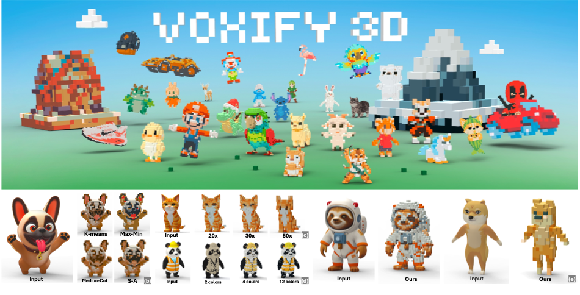
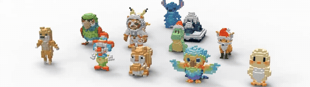

# Voxify3D: Pixel Art Meets Volumetric Rendering

**CVPR 2026**

[**Project Page**](https://yichuanh.github.io/Voxify-3D/) | [**ArXiv**](https://arxiv.org/abs/2512.07834)

<p align="center">
  
</p>
<p align="center">
  
</p>

Official implementation of **Voxify3D**, a pipeline for converting 3D models into stylized voxel art. We combine pixel art guidance with Direct Voxel Grid Optimization (DVGO) and Gumbel-softmax color quantization to produce low-resolution, palette-constrained voxel representations from arbitrary 3D inputs.

---

## Table of Contents

- [Environment Setup](#environment-setup)
- [Pretrained Models](#pretrained-models)
- [Pipeline 1: GLB Input](#pipeline-1-glb-to-voxel-art-run_voxify3d_glbpy)
- [Pipeline 2: Pre-rendered Images](#pipeline-2-pre-rendered-images-to-voxel-art-run_voxify3dpy)
- [Acknowledgement](#acknowledgement)
- [Citation](#citation)
- [License](#license)

---

## Tested Environment

| Component | Version |
|---|---|
| OS | Ubuntu 20.04 / 22.04 |
| Python | 3.10 |
| CUDA | 11.8 |
| PyTorch | 2.5.0 |
| torchvision | 0.20.0 |
| torchaudio | 2.5.0 |
| mmcv | 2.2.0 |
| Blender | 3.x / 4.x |

> Using other Python / CUDA / PyTorch versions may require additional adjustments, especially for `torch_scatter` and `mmcv` which are tightly coupled to specific CUDA and PyTorch versions.

---

## Two Pipelines

| Script | Input | When to use |
|---|---|---|
| `Run_Voxify3D_glb.py` | `.glb` 3D model file | You have a GLB file and want an end-to-end result. Blender is required to auto-render orthographic images. |
| `Run_Voxify3d.py` | Pre-rendered orthographic images | You have already prepared 50–100 orthographic-rendered images. |

---

## Environment Setup

We recommend creating a dedicated conda environment:

```bash
conda create -n voxify3d python=3.10 -y
conda activate voxify3d
```

> **Before running `pip install -r requirements.txt`**, manually install the following packages that are tightly coupled to your CUDA and PyTorch versions:
> - `torch` / `torchvision` / `torchaudio`
> - `torch_scatter`
> - `mmcv`
> - `torch-efficient-distloss`
>
> These cannot be installed generically — please refer to each project's official installation instructions and match the versions to your environment. Using mismatched versions is the most common cause of setup failures.

Once the above are installed:

```bash
pip install -r requirements.txt
```

### Additional requirement for `Run_Voxify3D_glb.py`

`Run_Voxify3D_glb.py` uses **Blender** to automatically render orthographic images from a GLB file. Blender cannot be installed via pip:

1. Download Blender from https://www.blender.org/download/ (tested with Blender 3.x / 4.x)
2. In `Run_Voxify3D_glb.py`, update `blender_exe` to the absolute path of your Blender executable:

```python
blender_exe = "/path/to/your/blender"
```

---

## Pretrained Models

Download the following pretrained models and place them in the specified directories.

### PixelArt models

These models are from **"Make Your Own Sprites: Aliasing-Aware and Cell-Controllable Pixelization"** (SIGGRAPH Asia 2022) and are subject to their own **non-commercial license**. Please read and comply with the [original license](https://github.com/WuZongWei6/Pixelization) before use. **Unauthorized commercial use is prohibited.**

| Model | Destination | Download |
|---|---|---|
| Pixel Art checkpoint | `PixelArt/` | [Download](https://drive.google.com/file/d/1VRYKQOsNlE1w1LXje3yTRU5THN2MGdMM/view?usp=sharing) |
| AliasNet checkpoint | `PixelArt/` | [Download](https://drive.google.com/file/d/17f2rKnZOpnO9ATwRXgqLz5u5AZsyDvq_/view?usp=sharing) |
| I2PNet checkpoint | `PixelArt/checkpoints/pixel_model` | [Download](https://drive.google.com/file/d/1i_8xL3stbLWNF4kdQJ50ZhnRFhSDh3Az/view?usp=sharing) |
| P2INet checkpoint | `PixelArt/checkpoints/pixel_model` | [Download](https://drive.google.com/file/d/1z9SmQRPoIuBT_18mzclEd1adnFn2t78T/view?usp=sharing) |

---

## Pipeline 1: GLB to Voxel Art (`Run_Voxify3D_glb.py`)

This pipeline takes a `.glb` file as input and handles orthographic rendering automatically using Blender.

**1. Place your GLB file:**

```text
Voxify3D/data/{data_root}/{scene}/{scene}.glb

# Example:
Voxify3D/data/GLB/fallguy/fallguy.glb
```

**2. Edit `scene_configs` in `Run_Voxify3D_glb.py`:**

```python
scene_configs = {
    "fallguy": [[50, "kmeans_rare", 8], [30, "kmeans_rare", 6]],
}
```

Each entry is `[cell_size, palette_mode, color_num]`. Supported palette modes: `kmeans`, `kmeans_rare`, `maxmin`, `mediancut`, `sa`.

**3. Run:**

```bash
python Run_Voxify3D_glb.py --device 0 --data_root GLB
```

**Checking render quality:** After the first run, verify the object scale in the rendered images. If needed, adjust `WORLD_SIZE` in `Voxify3D/glb2img.py`:

```python
WORLD_SIZE = 2.0  # Increase to zoom out, decrease to zoom in
```

Then delete `ortho/` and `6views/` folders (keep the `.glb`) and re-run.

**Output:** Results are saved under `Voxify3D/voxel_result/`.

---

## Pipeline 2: Pre-rendered Images to Voxel Art (`Run_Voxify3d.py`)

Use this pipeline if you have already prepared **50–100 orthographic-rendered images** with known camera parameters.

**1. Edit the configuration in `Run_Voxify3d.py`:**

```python
data_root = "Rodin"

scene_configs = {
    "Dragon": 25,
}

color_nums = [6]
palette_modes = ["kmeans_rare"]  # "kmeans", "maxmin", "mediancut", "sa"
```

**2. Run:**

```bash
python Run_Voxify3d.py --gpu 0
```

---

## Acknowledgement

Our pixel art pipeline and models are based on
*Make Your Own Sprites: Aliasing-Aware and Cell-Controllable Pixelization* (ACM TOG).

The core voxel rendering pipeline is built upon
*Direct Voxel Grid Optimization*.

The dataset used in this project is derived from
*Rodin: A Generative Model for Sculpting 3D Digital Avatars Using Diffusion*.

We thank the authors for making their work publicly available.

---

## Citation

If you find our work useful, please cite:

```bibtex
@inproceedings{huang2026voxify3d,
  author    = {Huang, Yi-Chuan and Chan, Jiewen and Chien, Hao-Jen and Liu, Yu-Lun},
  title     = {Voxify3D: Pixel Art Meets Volumetric Rendering},
  booktitle = {CVPR},
  year      = {2026}
}
```

---

## License

This project is licensed for **non-commercial scientific research purposes only**. See [LICENSE](LICENSE) for full terms.

Note: The PixelArt pretrained models used in this pipeline are from a third-party work and carry their own non-commercial restriction. Commercial use of any part of this pipeline is prohibited.
